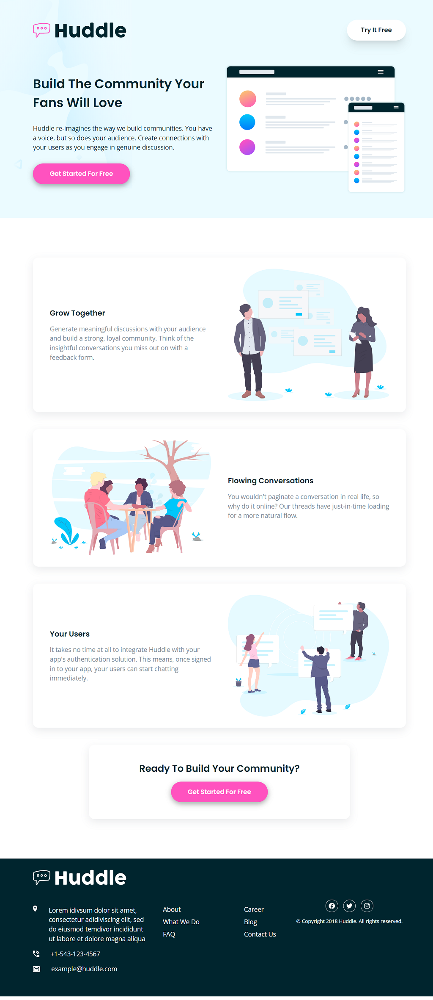
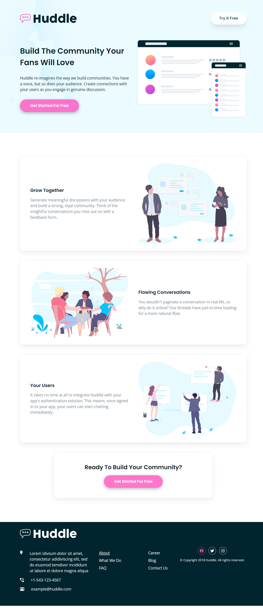
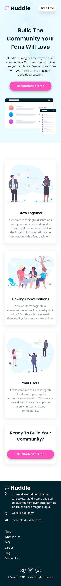

# Frontend Mentor - Huddle landing page with alternating feature blocks solution

This is a solution to the [Huddle landing page with alternating feature blocks challenge on Frontend Mentor](https://www.frontendmentor.io/challenges/huddle-landing-page-with-alternating-feature-blocks-5ca5f5981e82137ec91a5100). Frontend Mentor challenges help you improve your coding skills by building realistic projects.

## Table of contents

- [Overview](#overview)
  - [Screenshot](#screenshot)
  - [Links](#links)
- [My process](#my-process)
  - [Built with](#built-with)
  - [What I learned](#what-i-learned)
- [Author](#author)
- [Acknowledgments](#acknowledgments)

## Overview

### Screenshot

Desktop View :

Desktop View with hover :

Mobile View :

### Links

- Solution URL: [Github Repo](https://github.com/to-my-learning-path/huddle-landing-page-with-blocks)
- Live Site URL: [Github Pages](https://to-my-learning-path.github.io/huddle-landing-page-with-blocks)

## My process

### Built with

- Semantic HTML5 markup
- CSS custom properties
- Flexbox
- Grid
- Mobile-First Approach

### What I learned

I learned how to create landing page in React.

## Author

- Frontend Mentor - [@Omar](https://www.frontendmentor.io/profile/to-my-learning-path)
